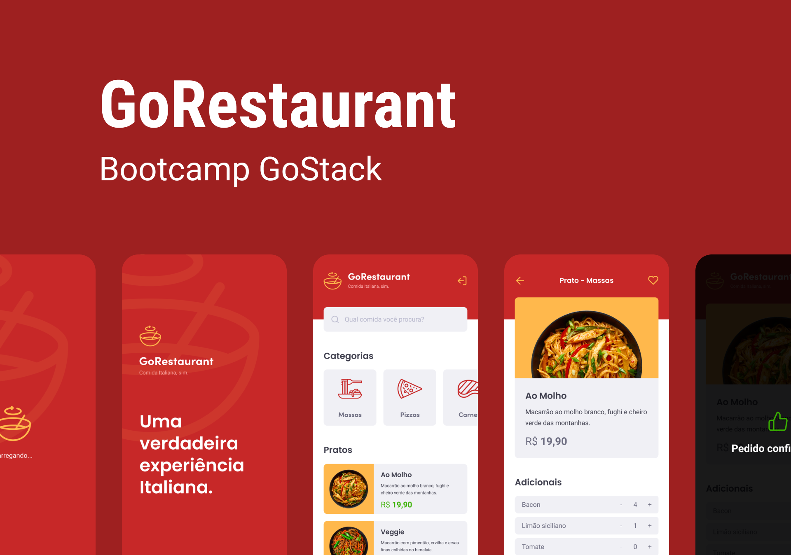

<div align="center">
  
</div>


<br>

## 🎯 Indice

  - [Tecnologias](#-tecnologias)
  - [Como Executar o Projeto](#-como-executar-o-projeto)
  - [Layout](#-layout)
  - [Licença](#-licença)

</div>

<br>

<br>

## 💻 O que é o GoRestaurant Mobile

<br>

A aplicação GoRestaurant Mobile é do seguimento Delivery onde os clientes podem encomendar suas comidas. Possue função para salvar nos favoritos e adicionar extras ao pedido. Foi criada no bootcamp GoStack como desafio 11 para praticar e fixar os conceitos aprendidos no decorrer dos estudos em **React Native** além de conhecer mais o consumo de uma Fake API.

<br>

## 🚀 Tecnologias

Esse projeto foi desenvolvido com as seguintes tecnologias:

- [React Native](https://reactnative.dev/)
- [Axios](https://github.com/axios/axios)
- [Styled-components](https://styled-components.com)
- [TypeScript](https://www.typescriptlang.org)
- [JSON Server - Fake API](https://github.com/typicode/json-server)

<br>

## 📦 Como Executar o Projeto:

```bash


  # Para clonar o repositório para seu computador

  $ git clone https://github.com/mauriciogirardi/AppGoRestaurant.git


  # Entrar na pasta do projeto

  $ cd AppGoRestaurant


  # Para instalar todas as dependências do projeto

  $ yarn


  # Para iniciar a aplicação execute

  $ yarn start

```

## 🚦 Importante:

Siga os passos a seguir para [Configurar Ambiente React Native](https://react-native.rocketseat.dev/)


## 📦 Como Executar o Projeto Back-end

```bash

  # Após instalar todas as dependências via yarn

  # Execute o comando a abaixo para iniciar a aplicação em http://localhost:3333/

  $ yarn json-server server.json -p 3333
  ```

## 🚦 Importante:

Caso venha a usar o dispositivo físico, verifique se o pc e o dispositivo estão na mesma rede e execute.

``` bash
$ yarn json-server --host IP_DA_SUA_MAQUINA server.json -p 3333

# Não esqueça de alterar a baseURL no arquivo em src/services/api.ts, para 'http://IP_DA_SUA_MAQUINA:3333'

```
<br>

## 📟 Layout

Você pode ver o layout detalhado através do figma. [nesse link](https://www.figma.com/file/cHzfYrUBgdzp1XrRuUpggk/GoRestaurant-Mobile?node-id=1603%3A448)

<br>

## 📋 Licença

Esse projeto está sob a licença MIT. Veja o arquivo [LICENSE](https://github.com/mauriciogirardi/AppGoRestaurant/blob/main/LICENSE) para mais detalhes.
